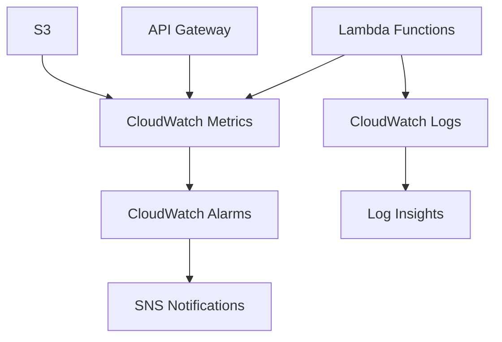

# Monitoring & Observability

Este guia aborda as estratégias de monitoramento, logging e observabilidade para o URL Shortener System, incluindo configurações do AWS CloudWatch e métricas importantes a serem acompanhadas.

## Visão Geral do Monitoramento

O sistema utiliza os serviços nativos da AWS para observabilidade:



## Métricas Principais

### Lambda Functions

#### Create URL Service
| Métrica | Descrição | Threshold Recomendado |
|---------|-----------|----------------------|
| `Duration` | Tempo de execução | < 5000ms |
| `Errors` | Número de erros | < 1% das invocações |
| `Throttles` | Execuções limitadas | 0 |
| `Invocations` | Total de execuções | - |
| `ConcurrentExecutions` | Execuções simultâneas | < 80% do limite |

#### Redirect URL Service
| Métrica | Descrição | Threshold Recomendado |
|---------|-----------|----------------------|
| `Duration` | Tempo de execução | < 3000ms |
| `Errors` | Número de erros | < 2% das invocações |
| `DeadLetterErrors` | Erros não tratados | 0 |
| `Invocations` | Total de execuções | - |

### API Gateway
| Métrica | Descrição | Threshold Recomendado |
|---------|-----------|----------------------|
| `4XXError` | Erros do cliente | < 5% |
| `5XXError` | Erros do servidor | < 1% |
| `Latency` | Latência das requisições | < 2000ms |
| `Count` | Número de requisições | - |

### Amazon S3
| Métrica | Descrição | Threshold Recomendado |
|---------|-----------|----------------------|
| `4xxErrors` | Erros de acesso | < 1% |
| `FirstByteLatency` | Latência do primeiro byte | < 100ms |
| `TotalRequestLatency` | Latência total | < 200ms |

## Configuração de Logs

### CloudWatch Log Groups

```bash
# Log Groups criados automaticamente
/aws/lambda/CreateUrlLambda
/aws/lambda/RedirectUrlShortner
/aws/apigateway/url-shortener-api
```

### Estrutura de Logs Recomendada

=== "Create URL Service"
    ```java
    // Exemplo de logging estruturado
    import org.slf4j.Logger;
    import org.slf4j.LoggerFactory;
    
    public class Main {
        private static final Logger logger = LoggerFactory.getLogger(Main.class);
        
        @Override
        public Map<String, String> handleRequest(Map<String, Object> input, Context context) {
            String requestId = context.getAwsRequestId();
            
            logger.info("Processing request: {}", requestId);
            
            try {
                // Lógica do serviço
                String shortCode = processUrl(originalUrl);
                
                logger.info("URL created successfully - RequestId: {}, Code: {}, OriginalUrl: {}", 
                           requestId, shortCode, originalUrl);
                
                return response;
            } catch (Exception e) {
                logger.error("Error processing request - RequestId: {}, Error: {}", 
                            requestId, e.getMessage(), e);
                throw e;
            }
        }
    }
    ```

=== "Redirect URL Service"
    ```java
    // Logging para redirecionamento
    logger.info("Redirect request - RequestId: {}, Code: {}", requestId, shortCode);
    
    if (urlData.getExpirationTime() < currentTime) {
        logger.warn("Expired URL accessed - RequestId: {}, Code: {}, ExpiredAt: {}", 
                   requestId, shortCode, urlData.getExpirationTime());
        return expiredResponse;
    }
    
    logger.info("Successful redirect - RequestId: {}, Code: {}, Target: {}", 
               requestId, shortCode, urlData.getOriginalUrl());
    ```

## Alertas e Alarmes

### Alarmes Críticos

#### High Error Rate
```yaml
AlarmName: URLShortener-HighErrorRate
MetricName: Errors
Threshold: 5 # 5 erros em 5 minutos
ComparisonOperator: GreaterThanThreshold
EvaluationPeriods: 1
Period: 300
```

#### High Latency
```yaml
AlarmName: URLShortener-HighLatency
MetricName: Duration
Threshold: 5000 # 5 segundos
ComparisonOperator: GreaterThanThreshold
EvaluationPeriods: 2
Period: 300
```

#### Lambda Throttling
```yaml
AlarmName: URLShortener-Throttling
MetricName: Throttles
Threshold: 1
ComparisonOperator: GreaterThanOrEqualToThreshold
EvaluationPeriods: 1
Period: 60
```

### Configuração via CloudFormation

```yaml
Resources:
  HighErrorRateAlarm:
    Type: AWS::CloudWatch::Alarm
    Properties:
      AlarmName: !Sub "${AWS::StackName}-HighErrorRate"
      AlarmDescription: "High error rate in URL Shortener"
      MetricName: Errors
      Namespace: AWS/Lambda
      Statistic: Sum
      Period: 300
      EvaluationPeriods: 1
      Threshold: 5
      ComparisonOperator: GreaterThanThreshold
      Dimensions:
        - Name: FunctionName
          Value: !Ref CreateUrlFunction
      AlarmActions:
        - !Ref SNSTopic

  SNSTopic:
    Type: AWS::SNS::Topic
    Properties:
      DisplayName: "URL Shortener Alerts"
      Subscription:
        - Protocol: email
          Endpoint: admin@exemplo.com
```

## Dashboards

### CloudWatch Dashboard Principal

```json
{
  "widgets": [
    {
      "type": "metric",
      "properties": {
        "metrics": [
          ["AWS/Lambda", "Invocations", "FunctionName", "CreateUrlLambda"],
          ["AWS/Lambda", "Invocations", "FunctionName", "RedirectUrlShortner"]
        ],
        "period": 300,
        "stat": "Sum",
        "region": "us-east-1",
        "title": "Lambda Invocations"
      }
    },
    {
      "type": "metric",
      "properties": {
        "metrics": [
          ["AWS/Lambda", "Duration", "FunctionName", "CreateUrlLambda"],
          ["AWS/Lambda", "Duration", "FunctionName", "RedirectUrlShortner"]
        ],
        "period": 300,
        "stat": "Average",
        "region": "us-east-1",
        "title": "Average Duration"
      }
    },
    {
      "type": "metric",
      "properties": {
        "metrics": [
          ["AWS/Lambda", "Errors", "FunctionName", "CreateUrlLambda"],
          ["AWS/Lambda", "Errors", "FunctionName", "RedirectUrlShortner"]
        ],
        "period": 300,
        "stat": "Sum",
        "region": "us-east-1",
        "title": "Errors"
      }
    }
  ]
}
```

## Log Insights Queries

### Queries Úteis para Troubleshooting

#### Top Errors
```sql
fields @timestamp, @message
| filter @message like /ERROR/
| stats count() by bin(5m)
| sort @timestamp desc
```

#### Slow Requests
```sql
fields @timestamp, @duration, @requestId
| filter @duration > 3000
| sort @duration desc
| limit 100
```

#### URL Creation Analysis
```sql
fields @timestamp, @message
| filter @message like /URL created successfully/
| parse @message "Code: *, OriginalUrl: *" as shortCode, originalUrl
| stats count() by bin(1h)
```

#### Expired URLs Access
```sql
fields @timestamp, @message
| filter @message like /Expired URL accessed/
| parse @message "Code: *, ExpiredAt: *" as shortCode, expiredAt
| stats count() by shortCode
| sort count desc
```

## Métricas Customizadas

### Implementação de Métricas de Negócio

```java
import software.amazon.awssdk.services.cloudwatch.CloudWatchClient;
import software.amazon.awssdk.services.cloudwatch.model.*;

public class MetricsHelper {
    private final CloudWatchClient cloudWatch = CloudWatchClient.create();
    
    public void recordUrlCreated(String region) {
        putMetric("URLShortener/Business", "URLsCreated", 1.0, 
                 Map.of("Region", region));
    }
    
    public void recordUrlAccessed(String shortCode, boolean expired) {
        putMetric("URLShortener/Business", "URLsAccessed", 1.0, 
                 Map.of("Status", expired ? "Expired" : "Success"));
    }
    
    private void putMetric(String namespace, String metricName, 
                          Double value, Map<String, String> dimensions) {
        List<Dimension> dims = dimensions.entrySet().stream()
            .map(entry -> Dimension.builder()
                .name(entry.getKey())
                .value(entry.getValue())
                .build())
            .collect(Collectors.toList());
            
        MetricDatum datum = MetricDatum.builder()
            .metricName(metricName)
            .value(value)
            .dimensions(dims)
            .build();
            
        PutMetricDataRequest request = PutMetricDataRequest.builder()
            .namespace(namespace)
            .metricData(datum)
            .build();
            
        cloudWatch.putMetricData(request);
    }
}
```

## Troubleshooting Playbook

### Problema: Alta Latência

**Sintomas:**  

- Duration > 5000ms  
- Timeouts frequentes

**Investigação:**  

1. Verificar logs de performance  
2. Analisar cold starts  
3. Verificar latência do S3  

**Soluções:**  

- Provisioned Concurrency para evitar cold starts  
- Otimizar código Java  
- Usar S3 Transfer Acceleration  

### Problema: Errors 5XX

**Sintomas:**  

- Errors > 1% das invocações  
- Falhas de acesso ao S3  

**Investigação:**
```sql
fields @timestamp, @message
| filter @message like /Error/
| stats count() by bin(5m)
```

**Soluções:**  

- Verificar permissões IAM  
- Implementar retry automático  
- Validar configuração do S3  

### Problema: Throttling

**Sintomas:**  

- Throttles > 0  
- 429 Too Many Requests  

**Investigação:**  

- Verificar limites de concorrência  
- Analisar padrões de tráfego  

**Soluções:**  

- Aumentar Reserved Concurrency  
- Implementar backoff exponencial  
- Distribuir carga temporalmente  

## Monitoramento Mobile/Web

### Health Check Endpoint

```java
// Endpoint adicional para health check
@Override
public Map<String, Object> healthCheck(Map<String, Object> input, Context context) {
    Map<String, Object> response = new HashMap<>();
    
    try {
        // Testar conectividade com S3
        s3Client.headBucket(HeadBucketRequest.builder()
                           .bucket("aws-url-shortner-app")
                           .build());
        
        response.put("status", "healthy");
        response.put("timestamp", System.currentTimeMillis());
        response.put("version", "1.0.0");
    } catch (Exception e) {
        response.put("status", "unhealthy");
        response.put("error", e.getMessage());
    }
    
    return response;
}
```

## Checklist de Monitoramento

### Setup Inicial
- [ ] CloudWatch Logs habilitados
- [ ] Métricas básicas configuradas
- [ ] Alarmes críticos criados
- [ ] Dashboard principal configurado
- [ ] SNS topic para alertas

### Monitoramento Contínuo
- [ ] Revisar métricas diariamente
- [ ] Analisar logs de erro semanalmente
- [ ] Ajustar thresholds mensalmente
- [ ] Documentar incidentes
- [ ] Otimizar performance baseado em dados

### Alertas Configurados
- [ ] High error rate (> 1%)
- [ ] High latency (> 5s)
- [ ] Lambda throttling
- [ ] S3 errors
- [ ] API Gateway 5XX errors
