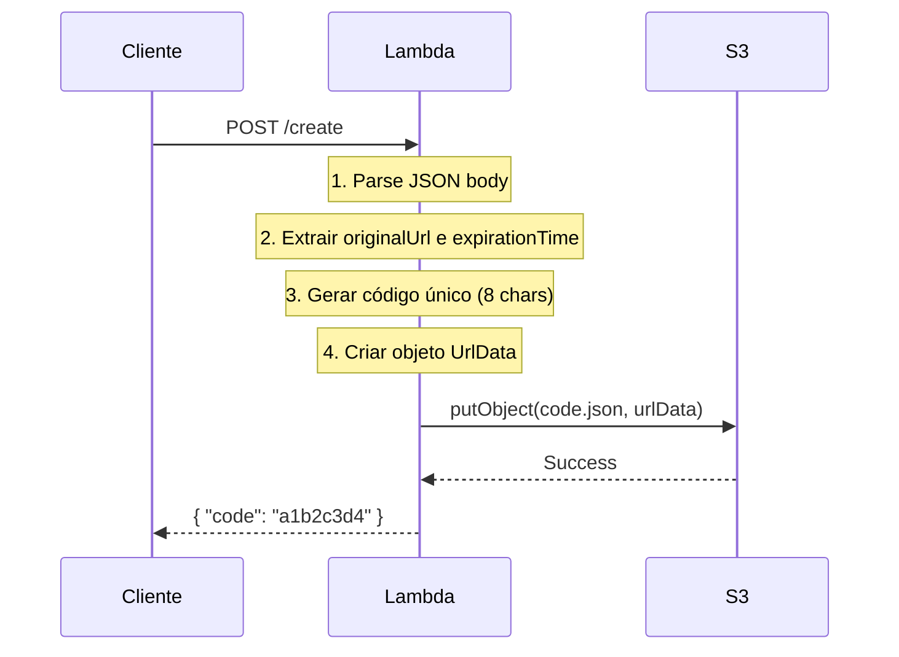

# Create URL Service API

O **Create URL Service** é responsável por gerar URLs encurtadas e armazená-las no Amazon S3. Este serviço implementa a funcionalidade principal de criação do sistema de encurtamento de URLs.

## Visão Geral

| Propriedade | Valor |
|-------------|-------|
| **Método HTTP** | `POST` |
| **Endpoint** | `/create` |
| **Content-Type** | `application/json` |
| **AWS Lambda** | `CreateUrlLambda` |
| **Handler** | `com.rocketseat.createUrlShortner.Main::handleRequest` |

## Endpoint

```
POST https://your-api-gateway-url.com/create
```

## Request

### Headers
```http
Content-Type: application/json
```

### Body Schema

```json
{
  "originalUrl": "string",
  "expirationTime": "string"
}
```

#### Parâmetros

| Campo | Tipo | Obrigatório | Descrição |
|-------|------|-------------|-----------|
| `originalUrl` | `string` | ✅ | URL original que será encurtada |
| `expirationTime` | `string` | ✅ | Timestamp Unix em segundos para expiração |

!!! info "Formato do expirationTime"
    O campo `expirationTime` deve ser um timestamp Unix em segundos (não milissegundos).
    
    **Exemplo**: `1672531200` = 1º de Janeiro de 2023, 00:00:00 UTC

### Exemplo de Request

=== "cURL"
    ```bash
    curl -X POST https://your-api-gateway-url.com/create \
      -H "Content-Type: application/json" \
      -d '{
        "originalUrl": "https://exemplo.com/artigo-muito-longo-sobre-tecnologia",
        "expirationTime": "1672531200"
      }'
    ```

=== "JavaScript"
    ```javascript
    const response = await fetch('https://your-api-gateway-url.com/create', {
      method: 'POST',
      headers: {
        'Content-Type': 'application/json'
      },
      body: JSON.stringify({
        originalUrl: 'https://exemplo.com/artigo-muito-longo-sobre-tecnologia',
        expirationTime: '1672531200'
      })
    });
    
    const data = await response.json();
    console.log('URL encurtada:', data.code);
    ```

=== "Python"
    ```python
    import requests
    import json
    
    url = "https://your-api-gateway-url.com/create"
    payload = {
        "originalUrl": "https://exemplo.com/artigo-muito-longo-sobre-tecnologia",
        "expirationTime": "1672531200"
    }
    
    response = requests.post(url, json=payload)
    data = response.json()
    print(f"URL encurtada: {data['code']}")
    ```

## Response

### Success Response (200 OK)

```json
{
  "code": "a1b2c3d4"
}
```

#### Campos da Resposta

| Campo | Tipo | Descrição |
|-------|------|-----------|
| `code` | `string` | Código único de 8 caracteres da URL encurtada |

!!! success "Código Gerado"
    O código é gerado usando `UUID.randomUUID().toString().substring(0, 8)`, garantindo unicidade estatística.

### Error Responses

#### 400 Bad Request - JSON Inválido
```json
{
  "errorMessage": "Error parsing JSON body: Unexpected character...",
  "errorType": "RuntimeException"
}
```

#### 500 Internal Server Error - Erro no S3
```json
{
  "errorMessage": "Error saving data to S3: Access Denied",
  "errorType": "RuntimeException"
}
```

## Funcionamento Interno

### Fluxo de Processamento



### Geração do Código

```java
String shortUrlCode = UUID.randomUUID().toString().substring(0, 8);
```

- **Método**: Primeiros 8 caracteres de um UUID v4
- **Formato**: Alfanumérico (a-z, 0-9, hífen)
- **Exemplo**: `a1b2c3d4`, `7f8e9d2a`, `uuid-123`
- **Colisões**: Estatisticamente improváveis para volume moderado

### Armazenamento no S3

#### Estrutura do Objeto
```json
{
  "originalUrl": "https://exemplo.com/url-original",
  "expirationTime": 1672531200
}
```

#### Configuração S3
- **Bucket**: `aws-url-shortner-app`
- **Key**: `{code}.json` (ex: `a1b2c3d4.json`)
- **Content-Type**: `application/json`

## Segurança e Permissões

### Permissões IAM Necessárias

```json
{
  "Version": "2012-10-17",
  "Statement": [
    {
      "Effect": "Allow",
      "Action": [
        "s3:PutObject"
      ],
      "Resource": "arn:aws:s3:::aws-url-shortner-app/*"
    }
  ]
}
```

### Considerações de Segurança

!!! warning "Validação de Entrada"
    O serviço atual não valida se a `originalUrl` é uma URL válida. Em produção, considere adicionar validação.

!!! tip "Rate Limiting"
    Considere implementar rate limiting no API Gateway para prevenir abuso.

## Exemplos Avançados

### URLs com Diferentes Expirações

=== "24 horas"
    ```bash
    # Expira em 24 horas a partir de agora
    EXPIRATION=$(date -d "+1 day" +%s)
    
    curl -X POST https://your-api-gateway-url.com/create \
      -H "Content-Type: application/json" \
      -d "{
        \"originalUrl\": \"https://exemplo.com/artigo-temporario\",
        \"expirationTime\": \"$EXPIRATION\"
      }"
    ```

=== "1 semana"
    ```bash
    # Expira em 1 semana
    EXPIRATION=$(date -d "+1 week" +%s)
    
    curl -X POST https://your-api-gateway-url.com/create \
      -H "Content-Type: application/json" \
      -d "{
        \"originalUrl\": \"https://exemplo.com/campanha-semanal\",
        \"expirationTime\": \"$EXPIRATION\"
      }"
    ```

=== "Sem expiração (100 anos)"
    ```bash
    # Expira em 100 anos (praticamente permanente)
    EXPIRATION=$(date -d "+100 years" +%s)
    
    curl -X POST https://your-api-gateway-url.com/create \
      -H "Content-Type: application/json" \
      -d "{
        \"originalUrl\": \"https://exemplo.com/link-permanente\",
        \"expirationTime\": \"$EXPIRATION\"
      }"
    ```

## Troubleshooting

### Erros Comuns

#### JSON Malformado
```bash
# ❌ Erro - JSON inválido
curl -X POST https://your-api-gateway-url.com/create \
  -H "Content-Type: application/json" \
  -d '{ "originalUrl": "https://exemplo.com" }'  # Missing expirationTime

# ✅ Correto
curl -X POST https://your-api-gateway-url.com/create \
  -H "Content-Type: application/json" \
  -d '{
    "originalUrl": "https://exemplo.com",
    "expirationTime": "1672531200"
  }'
```

#### Problemas de Permissão S3
```json
// Erro típico de permissão
{
  "errorMessage": "Error saving data to S3: Access Denied (Service: S3, Status Code: 403)",
  "errorType": "RuntimeException"
}
```

**Solução**: Verificar se a role do Lambda tem permissão `s3:PutObject` no bucket correto.

## Métricas e Monitoramento

### CloudWatch Metrics

- **Invocations**: Número de chamadas do Lambda
- **Duration**: Tempo de execução
- **Errors**: Número de erros
- **Throttles**: Execuções limitadas

### Logs Úteis

```bash
# Ver logs do Lambda
aws logs tail /aws/lambda/CreateUrlLambda --follow

# Filtrar erros
aws logs filter-log-events \
  --log-group-name /aws/lambda/CreateUrlLambda \
  --filter-pattern "ERROR"
```

## Próximos Passos

- [Redirect URL Service](redirect-url.md) - Como usar as URLs criadas
- [Deployment Guide](../deployment/aws-setup.md) - Como fazer deploy
- [Monitoring](../advanced/monitoring.md) - Configurar observabilidade