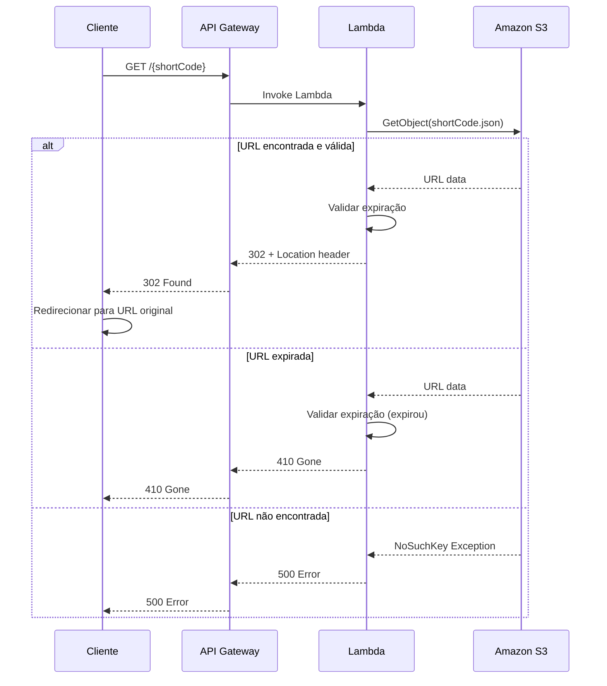

# Redirect URL Service API

O **Redirect URL Service** é responsável por resolver códigos de URLs encurtadas e redirecionar os usuários para as URLs originais correspondentes.

## 📋 Overview

| Propriedade | Valor |
|-------------|-------|
| **Método HTTP** | `GET` |
| **Endpoint** | `/{shortCode}` |
| **Função** | Redirecionamento para URL original |
| **Timeout** | 30 segundos |
| **Retries** | Não aplicável (GET) |

## 🔗 Endpoint

```
GET /{shortCode}
```

Onde `{shortCode}` é o código de 8 caracteres retornado pelo [Create URL Service](create-url.md).

## 📤 Request

### URL Parameters

| Parâmetro | Tipo | Obrigatório | Descrição |
|-----------|------|-------------|-----------|
| `shortCode` | string | ✅ | Código único de 8 caracteres da URL encurtada |

### Headers

Nenhum header específico é necessário para esta requisição.

### Exemplos de Request

=== "cURL"
    ```bash
    curl -I https://api.exemplo.com/a1b2c3d4
    ```

=== "JavaScript (Fetch)"
    ```javascript
    fetch('https://api.exemplo.com/a1b2c3d4', {
      method: 'GET',
      redirect: 'follow'
    })
    .then(response => {
      if (response.redirected) {
        console.log('Redirecionado para:', response.url);
      }
    });
    ```

=== "Python (Requests)"
    ```python
    import requests
    
    response = requests.get('https://api.exemplo.com/a1b2c3d4', 
                           allow_redirects=True)
    print(f"URL final: {response.url}")
    ```

## 📥 Response

### Cenários de Resposta

#### ✅ URL Válida (Sucesso)

**Status Code**: `302 Found`

```http
HTTP/1.1 302 Found
Location: https://exemplo.com/artigo-original-muito-longo
Content-Length: 0
Date: Wed, 04 Jun 2025 10:30:00 GMT
```

!!! success "Redirecionamento Automático"
    O navegador automaticamente seguirá o redirecionamento para a URL original.

#### ⏰ URL Expirada

**Status Code**: `410 Gone`

```http
HTTP/1.1 410 Gone
Content-Type: text/plain
Content-Length: 22
Date: Wed, 04 Jun 2025 10:30:00 GMT

This URL has expired.
```

!!! warning "URL Expirada"
    A URL encurtada ultrapassou seu tempo de vida útil definido na criação.

#### ❌ URL Não Encontrada

**Status Code**: `500 Internal Server Error`

```http
HTTP/1.1 500 Internal Server Error
Content-Type: application/json
Content-Length: 85
Date: Wed, 04 Jun 2025 10:30:00 GMT

{
  "errorMessage": "Error fetching URL data from S3: The specified key does not exist."
}
```

!!! danger "Código Inválido"
    O código fornecido não existe no sistema ou é inválido.

## 📊 Status Codes

| Status | Descrição | Cenário |
|--------|-----------|---------|
| `302` | **Found** | URL válida - redirecionamento realizado |
| `410` | **Gone** | URL expirou - não está mais disponível |
| `500` | **Internal Server Error** | Erro interno ou código não encontrado |

## 🔄 Fluxo de Redirecionamento



## ⚙️ Validação de Expiração

O serviço verifica automaticamente se a URL ainda está válida comparando:

```java
long currentTimeInSeconds = System.currentTimeMillis() / 1000;
if (urlData.getExpirationTime() < currentTimeInSeconds) {
    // URL expirou -> retorna 410 Gone
}
```

!!! info "Timestamp Unix"
    O tempo de expiração é armazenado como timestamp Unix (segundos desde 01/01/1970).

## 🛠️ Exemplos Práticos

### Teste de URL Válida

```bash
# 1. Criar uma URL (válida por 1 hora)
curl -X POST https://api.exemplo.com/create \
  -H "Content-Type: application/json" \
  -d '{
    "originalUrl": "https://github.com/seu-usuario/projeto",
    "expirationTime": "'$(($(date +%s) + 3600))'"
  }'

# Resposta: {"code": "a1b2c3d4"}

# 2. Testar redirecionamento
curl -I https://api.exemplo.com/a1b2c3d4

# Resposta esperada:
# HTTP/1.1 302 Found
# Location: https://github.com/seu-usuario/projeto
```

### Teste de URL Expirada

```bash
# Testar com código de URL expirada
curl -I https://api.exemplo.com/expired123

# Resposta esperada:
# HTTP/1.1 410 Gone
# This URL has expired.
```

### Teste de Código Inválido

```bash
# Testar com código inexistente
curl -I https://api.exemplo.com/invalid0

# Resposta esperada:
# HTTP/1.1 500 Internal Server Error
```

## 🔍 Monitoramento

### Métricas Importantes

- **Taxa de sucesso**: Porcentagem de redirects 302
- **URLs expiradas**: Quantidade de respostas 410
- **Códigos inválidos**: Quantidade de erros 500
- **Tempo de resposta**: Latência média do serviço

### Logs Típicos

```json
{
  "timestamp": "2025-06-04T10:30:00.000Z",
  "requestId": "a1b2c3d4-e5f6-7890-1234-567890abcdef",
  "shortCode": "a1b2c3d4",
  "status": "success",
  "statusCode": 302,
  "originalUrl": "https://exemplo.com/artigo",
  "responseTime": 45
}
```

## 🚀 Performance

### Otimizações Implementadas

- **Cold Start**: Minimizado com inicialização do S3Client
- **Memory**: Lambda configurado com 512MB para performance otimizada
- **Timeout**: 30 segundos para operações S3
- **Retry**: Configuração automática do AWS SDK

### Benchmarks Típicos

| Métrica | Valor Médio |
|---------|-------------|
| **Cold Start** | ~200ms |
| **Warm Request** | ~50ms |
| **S3 Fetch** | ~20ms |
| **Total Response Time** | ~70ms |

## 🔗 Integração

Este serviço trabalha em conjunto com o [Create URL Service](create-url.md):

1. **Create Service** gera o código e armazena no S3
2. **Redirect Service** resolve o código e faz o redirecionamento

Para mais detalhes sobre a arquitetura completa, consulte [System Overview](../architecture.md).

## ❓ Troubleshooting

### Problemas Comuns

??? question "URL não redireciona"
    
    **Possíveis causas:**
    
    - Código não existe no sistema
    - URL expirou
    - Problemas de conectividade com S3
    
    **Solução:**
    
    1. Verificar se o código existe: `aws s3 ls s3://aws-url-shortner-app/`
    2. Verificar logs do Lambda no CloudWatch
    3. Testar conectividade com S3

??? question "Erro 500 frequente"
    
    **Possíveis causas:**
    
    - Permissões IAM insuficientes
    - Bucket S3 não existe
    - Timeout na operação S3
    
    **Solução:**
    
    1. Verificar permissões IAM para `s3:GetObject`
    2. Confirmar existência do bucket
    3. Aumentar timeout do Lambda se necessário

Para mais detalhes, consulte [Troubleshooting Guide](../advanced/troubleshooting.md).