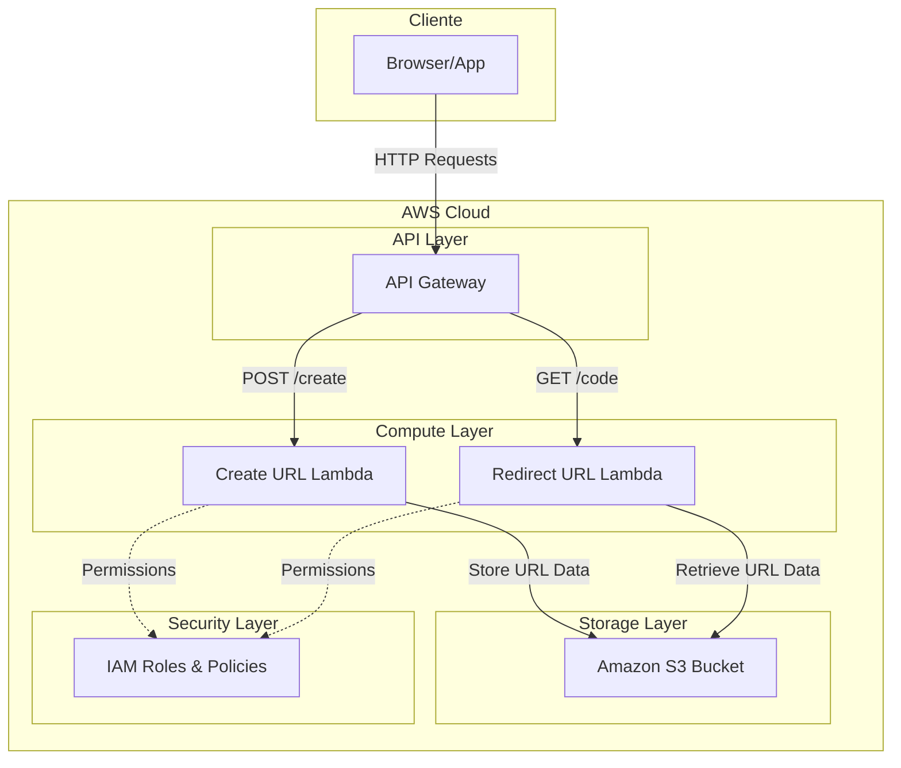
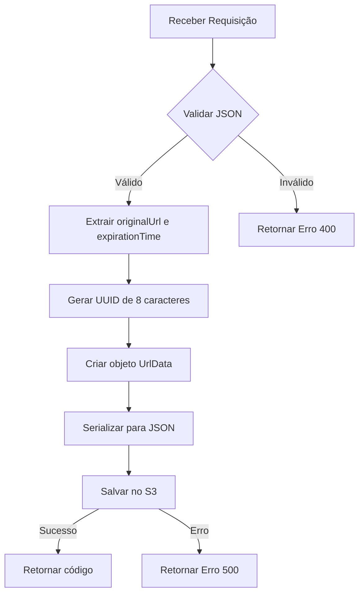
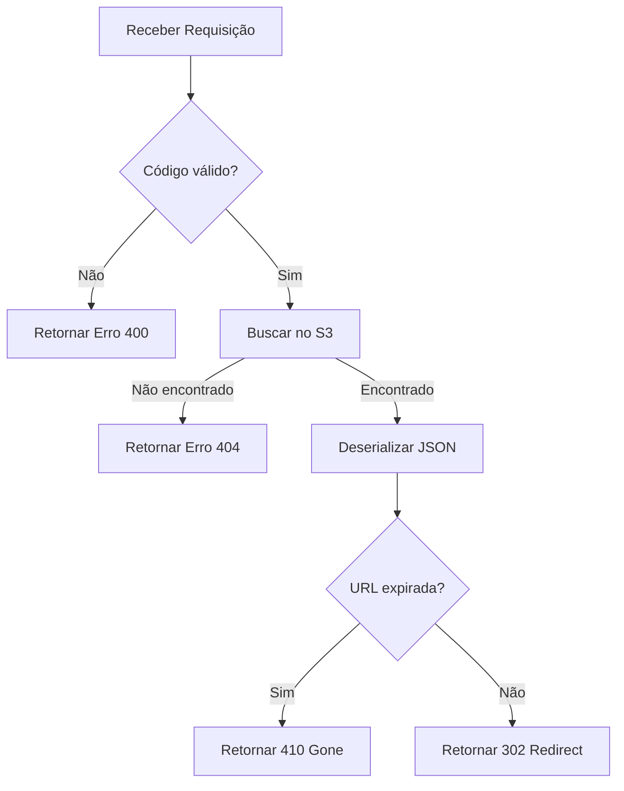
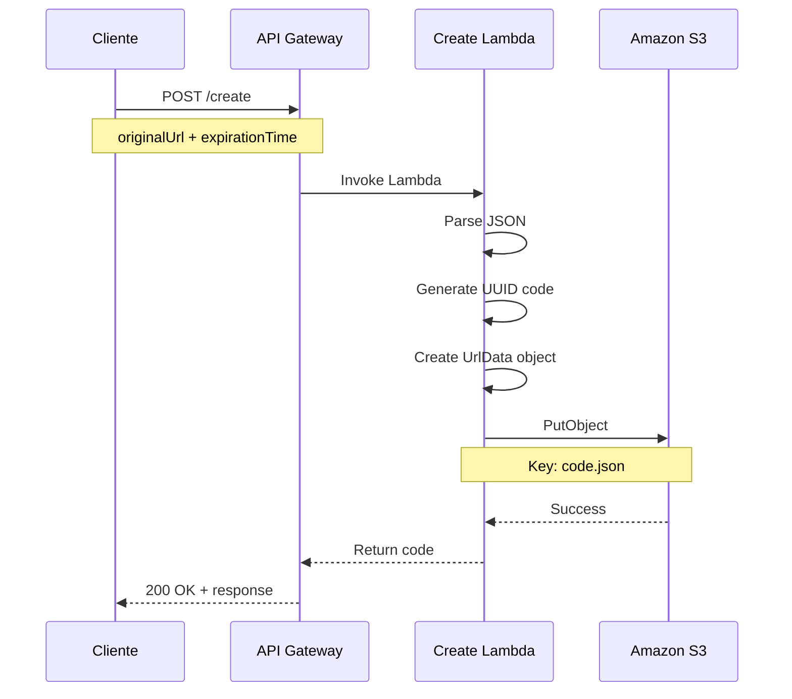
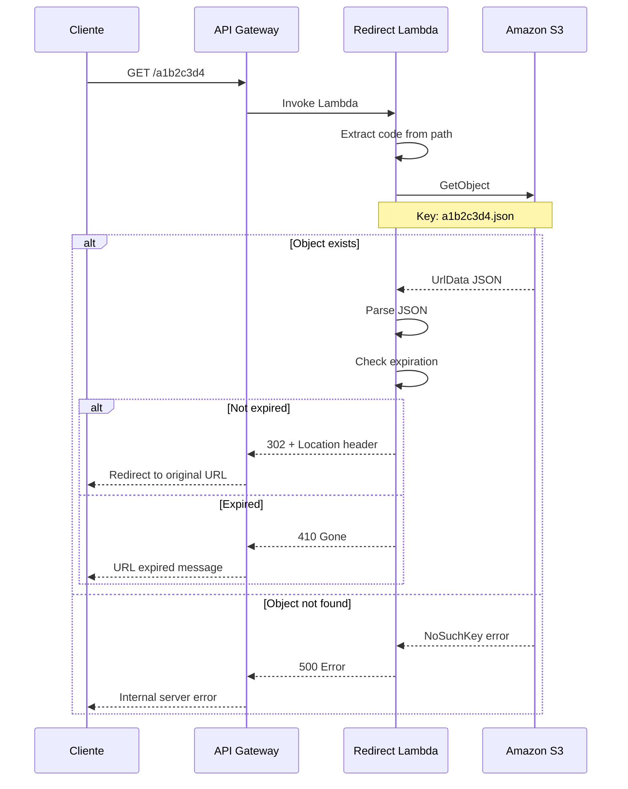

# System Architecture

Esta página detalha a arquitetura completa do URL Shortener System, incluindo componentes, fluxos de dados e decisões de design.

## Visão Geral da Arquitetura

O sistema foi projetado seguindo os princípios de **arquitetura serverless** e **microserviços**, proporcionando alta escalabilidade, baixo custo operacional e facilidade de manutenção.



## Princípios de Design

### 1. **Serverless First**
- Sem servidores para gerenciar
- Escalabilidade automática
- Modelo pay-per-use

### 2. **Microserviços**
- Separação de responsabilidades
- Deploy independente
- Resiliência isolada

### 3. **Event-Driven**
- Processamento assíncrono
- Baixo acoplamento
- Alta disponibilidade

### 4. **Stateless**
- Sem estado entre requisições
- Escalabilidade horizontal
- Recuperação rápida

## Componentes Detalhados

### API Gateway
**Responsabilidade**: Ponto de entrada único para todas as requisições

```yaml
Configuration:
  Type: REST API
  Endpoints:
    - POST /create     → Create URL Lambda
    - GET /{code}      → Redirect URL Lambda
  Features:
    - Rate limiting
    - Request validation
    - CORS support
    - API keys (opcional)
```

**Benefícios**:  

- Roteamento centralizado  
- Throttling automático  
- Logs de requisições  
- Transformação de dados  

### Create URL Lambda
**Responsabilidade**: Processar criação de URLs encurtadas



**Características Técnicas**:  

- **Runtime**: Java 17  
- **Memory**: 512 MB (recomendado)  
- **Timeout**: 30 segundos  
- **Handler**: `com.rocketseat.createUrlShortner.Main::handleRequest`  

### Redirect URL Lambda
**Responsabilidade**: Resolver códigos e redirecionar usuários



**Características Técnicas**:  

- **Runtime**: Java 17  
- **Memory**: 256 MB (suficiente)  
- **Timeout**: 15 segundos  
- **Handler**: `com.rocketseat.redirectUrlShortner.Main::handleRequest`  

### Amazon S3
**Responsabilidade**: Armazenamento persistente de dados das URLs

```yaml
Bucket Configuration:
  Name: aws-url-shortner-app
  Region: us-east-1 (recomendado)
  Versioning: Disabled
  Encryption: AES-256 (server-side)
  
Object Structure:
  Key: "{8-char-code}.json"
  Content: |
    {
      "originalUrl": "https://exemplo.com/url-longa",
      "expirationTime": 1672531200
    }
```

**Benefícios**:  

- Durabilidade de 99.999999999%  
- Escalabilidade ilimitada  
- Baixo custo por GB  
- Integração nativa com Lambda  

## Fluxos de Dados

### Fluxo de Criação de URL



### Fluxo de Redirecionamento



## Segurança e Permissions

### IAM Roles e Policies

#### Create URL Lambda Role
```json
{
  "Version": "2012-10-17",
  "Statement": [
    {
      "Effect": "Allow",
      "Action": [
        "logs:CreateLogGroup",
        "logs:CreateLogStream",
        "logs:PutLogEvents"
      ],
      "Resource": "arn:aws:logs:*:*:*"
    },
    {
      "Effect": "Allow",
      "Action": [
        "s3:PutObject",
        "s3:PutObjectAcl"
      ],
      "Resource": "arn:aws:s3:::aws-url-shortner-app/*"
    }
  ]
}
```

#### Redirect URL Lambda Role
```json
{
  "Version": "2012-10-17",
  "Statement": [
    {
      "Effect": "Allow",
      "Action": [
        "logs:CreateLogGroup",
        "logs:CreateLogStream",
        "logs:PutLogEvents"
      ],
      "Resource": "arn:aws:logs:*:*:*"
    },
    {
      "Effect": "Allow",
      "Action": [
        "s3:GetObject"
      ],
      "Resource": "arn:aws:s3:::aws-url-shortner-app/*"
    }
  ]
}
```

### Princípio do Menor Privilégio
- Cada Lambda tem apenas as permissões mínimas necessárias
- Acesso restrito apenas ao bucket específico
- Logs separados por função

## Performance e Escalabilidade

### Características de Performance

| Componente | Latência Típica | Throughput | Escalabilidade |
|------------|-----------------|------------|----------------|
| **API Gateway** | < 10ms | 10,000 RPS | Automática |
| **Create Lambda** | 100-500ms | 1,000 concurrent | Automática |
| **Redirect Lambda** | 50-200ms | 1,000 concurrent | Automática |
| **S3** | < 100ms | Unlimited | Automática |

### Otimizações Implementadas

**Cold Start Mitigation:** 

- Uso de Lombok para reduzir reflection  
- Jackson ObjectMapper reutilizado  
- Dependências mínimas  

**Memory Optimization:**

- Create Lambda: 512MB (processamento JSON)  
- Redirect Lambda: 256MB (operação mais simples)  

**S3 Performance:**  

- Naming strategy com UUID evita hot-spotting  
- Objetos pequenos (< 1KB) para baixa latência  

## Monitoramento e Observabilidade

### CloudWatch Metrics (Automáticas)
- **Duration**: Tempo de execução das Lambdas
- **Invocations**: Número de execuções
- **Errors**: Contagem de erros
- **Throttles**: Requisições limitadas

### Logs Estruturados
```java
// Exemplo de log estruturado
context.getLogger().log(String.format(
    "URL created: code=%s, originalUrl=%s, expirationTime=%d",
    shortUrlCode, originalUrl, expirationTimeInSeconds
));
```

### Alertas Recomendados
- Error rate > 5%
- Duration > 10 segundos
- Throttles > 0

## Benefícios da Arquitetura

### Escalabilidade
- **Automática**: Sem configuração manual
- **Elástica**: Escala para zero quando não há tráfego
- **Global**: Pode ser replicada em múltiplas regiões

### Confiabilidade
- **Sem single point of failure**
- **Retry automático** em falhas transitórias
- **Durabilidade** garantida pelo S3

### Custo-Efetividade
- **Pay-per-use**: Paga apenas pelo que consome
- **Sem infraestrutura ociosa**
- **Custo previsível** baseado no volume

### Developer Experience
- **Deployment simples**: JAR upload
- **Logs centralizados**: CloudWatch
- **Versionamento**: Lambda versions e aliases

## Próximos Passos

Esta arquitetura base permite evoluções como:

- **Cache Layer**: Redis/ElastiCache para URLs frequentes
- **Analytics**: DynamoDB para métricas de uso
- **CDN**: CloudFront para distribuição global
- **Custom Domains**: Route 53 para domínios personalizados
- **Batch Processing**: Limpeza automática de URLs expiradas

---

A arquitetura apresentada demonstra como construir sistemas modernos, escaláveis e cost-effective utilizando os princípios cloud-native e as melhores práticas de desenvolvimento serverless.