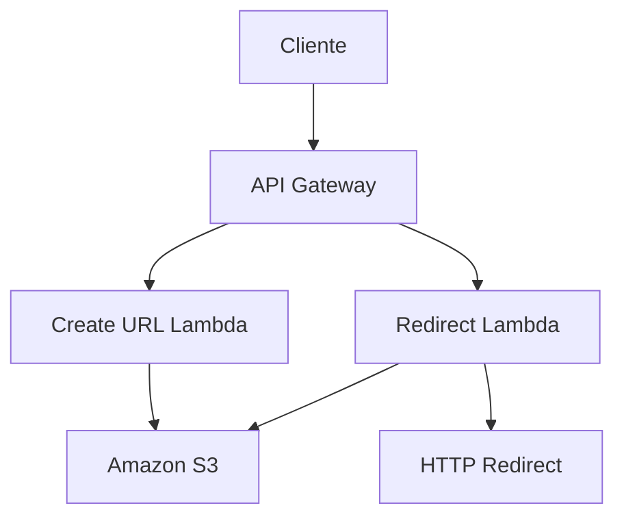

# URL Shortener System Documentation

Bem-vindo à documentação completa do **URL Shortener System** - uma solução serverless completa para encurtamento de URLs desenvolvida com Java e AWS.

## O que é este sistema?

Um encurtador de URLs moderno construído com arquitetura de microserviços serverless, demonstrando as melhores práticas de desenvolvimento cloud-native.



## Quick Start

=== "Criar URL"
```bash
curl -X POST https://api.exemplo.com/create \
  -H "Content-Type: application/json" \
  -d '{
    "originalUrl": "https://exemplo.com/artigo-longo",
    "expirationTime": "1672531200"
  }'
```

=== "Usar URL"
```bash
curl -I https://api.exemplo.com/a1b2c3d4
# → 302 Redirect para URL original
```

## Arquitetura

| Componente | Tecnologia | Responsabilidade |
|------------|------------|------------------|
| **Compute** | AWS Lambda | Processamento serverless |
| **Storage** | Amazon S3 | Armazenamento de dados |
| **API** | API Gateway | Roteamento de requisições |
| **Language** | Java 17 | Lógica de negócio |

## Navegação Rápida

### Getting Started
Configure e execute o sistema em minutos

[Quick Start](getting-started.md){ .md-button .md-button--primary }

### Deployment
Deploy completo na AWS com todas as configurações

[AWS Setup](deployment/aws-setup.md){ .md-button .md-button--primary }

### API Reference
Documentação completa das APIs disponíveis

[APIs](api/create-url.md){ .md-button .md-button--primary }

### Monitoring
Logs, métricas e troubleshooting

[Monitoring](advanced/monitoring.md){ .md-button .md-button--primary }

---

## Destaques Técnicos

!!! success "Arquitetura Serverless"
Zero infraestrutura para gerenciar, escalabilidade automática e pay-per-use.

!!! info "Microserviços"
Dois serviços independentes: criação e redirecionamento de URLs.

!!! tip "Tecnologias Modernas"
Java 17, AWS Lambda, S3, API Gateway, Maven e Jackson.

## Contribuindo

Este projeto foi desenvolvido durante evento de programação e está disponível para fins educacionais e demonstração de habilidades técnicas.

---

**Próximos passos**: Comece com o [Getting Started](getting-started.md) para executar o sistema localmente.
